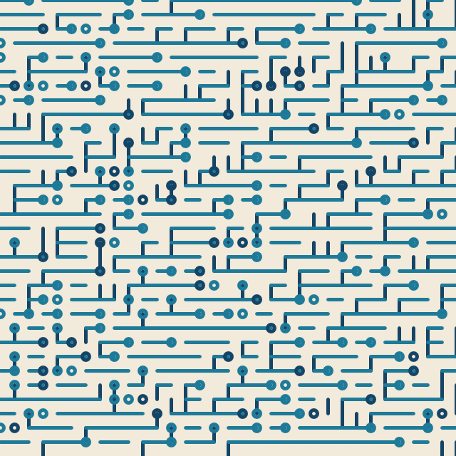

# Kotlin Processing Boilerplate

Basic project set up for Kotlin + Processing including Kotlin Gradle, run main file, run from gradle, testing, creation of jar bundling everything and runnable from other computers.

Made for use in IntelliJ (however should work find in any Gradle-supporting context).

# Gradle things

Run (the main application, a PApplet):

```
gradle run
```

Build to share `uberJar` (then can run like):

```
java -jar build/libs/processing-uber.jar
```

Add code for setup (NB remove noLoop() if you want to animate or do something interactive):

```kotlin
override fun setup() {
    background(255)
    colorMode(PConstants.HSB, 360f, 100f,100f, 1f)
    // remove if you want animations etc.
    noLoop()
}
```

and drawing:

```kotlin
override fun draw() {
    background(0f,0f,100f)
}
```

You can soon do things like:



## Bonus, some standard Kotlin extension for Processing

Quick random sampling from Lists or Sets (which you should use in preference to Java collections)

    val <T> List<T>.sample: T
            get() = this[Random.nextInt(this.size)]

    val <T> MutableSet<T>.sample: T
            get() = this.elementAt(Random.nextInt(this.size))

Essential:

    val Int.f: Float
            get() = this.toFloat()

    val Float.i: Int
            get() = this.toInt()

Found this handy in many places as often have list of points and want to draw lines between them

    val <T> List<T>.pairwise: List<Pair<T,T>>
        get() {
            if(this.size > 1) {
                var pairs = mutableListOf<Pair<T,T>>()
                for(i in 0 .. (this.size - 2)) {
                    pairs.add(this[i] to this[i + 1])
                }
                return pairs
            } else {
                return listOf()
            }
        }
